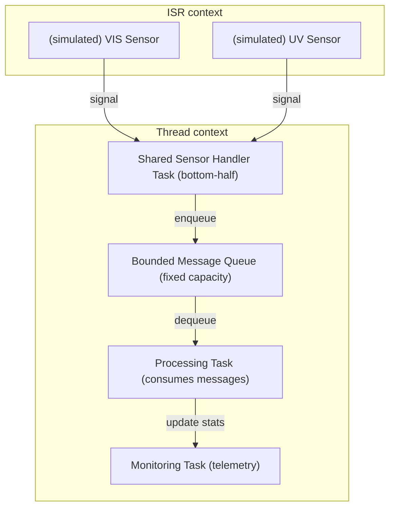

# Banknote Sensor RTOS

This project is a **real-time embedded application** implementing a simplified
banknote authentication pipeline.

It is developed and executed in a **RTOS environment**, running on a
host-based target for fast iteration. The execution model, constraints, and
failure modes are those of a microcontroller-class system; only the physical
sensors are abstracted during development.

The application is structured exactly as it would be for deployment on real
hardware.

## Scope

What this project **does**:
- Implements a real-time, multi-stage pipeline
- Uses strict RTOS primitives: threads, priorities, timers, bounded queues
- Enforces embedded constraints
- Simulates sensor inputs while keeping the application logic unchanged

This project doesnt replicate accuratly the electrical environement, is it made first to display the architecture and structure needed in a similar realistic context.



## Execution Environment

- **RTOS:** Zephyr RTOS  
- **Target:** `native_sim` (host-based execution for development and CI)
- **Host OS:** Linux

The same application can later be built for real microcontroller targets without
structural changes.

## Repository Model

This repository is **application-only**.

It contains:
- application source code
- RTOS configuration
- a manifest pinning external dependencies

It does **not** contain:
- the RTOS source tree
- external modules
- build artifacts
- toolchains or SDKs

All external components are fetched and managed by the workspace tooling.

## Build Environment

### Host
- Linux
- Python ≥ 3.10
- CMake, Ninja
- RTOS SDK

### Target
- Host-based RTOS execution (`native_sim`)

## Build and Run

Initialize the workspace and fetch dependencies:

```sh
west init -m <repo-url>
cd <workspace>
west update
west zephyr-export
```

Build:

```sh
west build -b native_sim .
```

Run:

```sh
./build/zephyr/zephyr.exe
```
